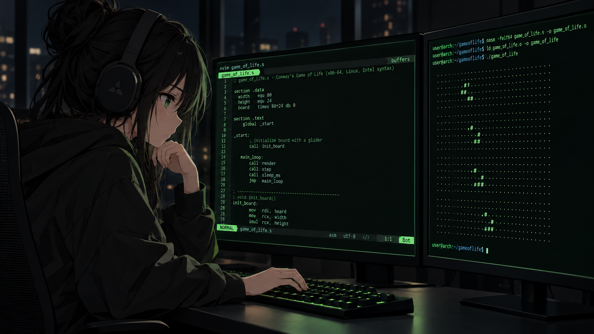

# Conway's Game of Life in x86-64 Assembly

<p align="center">
  
</p>

> Conway's Game of Life implemented from scratch in x86-64 Assembly,
> rendered directly in the terminal using Linux syscalls.

**No C runtime. No ncurses. No graphics library.**

Just Assembly, memory, syscalls and larping.

<p align="center">
  ──────────────[ x86-64 ]──────────────
</p>

I started this project after working with WASM because I wanted to go even lower and get a better understanding of how the programs interact with memory, registers and the operating system.

This project implements Conway's Game of Life completely in Assembly and runs it directly in the Linux terminal.

The board can be edited interactively before starting the simulation, and everything from rendering and keyboard input to timing and terminal configuration is handled directly through Linux syscalls.

<p align="center">
  ──────────────[ CURRENT STATE ]──────────────
</p>

## Current state

The program currently:

- stores the board as a 16x16 byte grid
- keeps a second grid as a snapshot of the previous generation
- counts the neighbors of every cell
- applies Conway's Game of Life rules
- prints living cells as `#`
- prints dead cells as `.`
- renders directly to stdout using the `write` syscall
- moves the terminal cursor back to the beginning between generations
- waits between generations using the `nanosleep` syscall
- starts with an empty grid
- lets you edit cells before simulation
- uses `h\j\k\l` for movement
- `Space` toggles cells
- `Enter` starts the simulation
- `q` exits
- reads keyboard input directly from the terminal
- switches the terminal to non-canonical mode using `ioctl/termios`
- uses ANSI escape sequences for cursor movement and visibility

<p align="center">
  ──────────────[ CONTROLS ]──────────────
</p>

## Controls

```
h       move left
j       move down
k       move up
l       move right
Space   toggle cell
Enter   start simulation
q       quit
```

<p align="center">
  ──────────────[ SYSCALLS ]──────────────
</p>

## Why in x86-64 Assembly

There is no:
- `printf`
- `sleep`
- runtime handling terminal input for me
- standard library

Printing to the terminal means using the write syscall directly.

Waiting between generations uses `nanosleep`.

Keyboard input is read directly from `stdin`

The terminal itself is configured through `ioctl` and `termios`, while ANSI escape sequences are used to move and hide the cursor.

This means the program has to manually deal with things that higher-level programs normally get for free:

- terminal configuration
- non-canonical keyboard input
- cursor movement
- memory layout
- double buffering
- timing
- exit and cleanup

Could this be easier in C?

Of course, but how can I larp with that.

<p align="center">
  ──────────────[ TERMINAL INPUT ]──────────────
</p>

## Terminal input

The terminals normally operate in canonical mode, this means that the input is buffered until you press Enter.

That does not work very well for something like this, where you need to make an action just by pressing one key.

The program uses `ioctl` with `termios` to disable ICANON and ECHO, allowing individual key presses to be read directly without printing them to the terminal.

During board editing, input blocks until a key is pressed.

Once the simulation starts, VMIN is changed so keyboard reads become non-blocking. This allows the program to check for input such as  `q` without stopping the simulation loop.

ANSI escape sequences are also used for terminal control:

- moving the cursor with h, j, k, l
- returning to the beginning of the board
- hiding the cursor during simulation
- restoring the cursor before existing

Before the program exits, the original terminal configuration is restored.

<p align="center">
  ──────────────[ MEMORY ]──────────────
</p>

## Memory

The simulation uses two 256-byte grids:

```text
grid
┌───────────────────────┐
│ current generation    │
│ 16 x 16 cells         │
│ 256 bytes             │
└───────────────────────┘

            copy
              │
              ▼

grid_ss
┌───────────────────────┐
│ generation snapshot   │
│ used while counting   │
│ neighbors             │
└───────────────────────┘
```

Each cell is represented by one byte:

0x00 -> dead
0x01 -> alive

The snapshot allows every cell to evaluate the same generation while the next state is being written.

<p align="center">
  ──────────────[ B3 / S23 ]──────────────
</p>

## Conway's rules

For every cell, the program counts its eight possible neighbors.

```text
┌───┬───┬───┐
│ 1 │ 2 │ 3 │
├───┼───┼───┤
│ 4 │ X │ 5 │
├───┼───┼───┤
│ 6 │ 7 │ 8 │
└───┴───┴───┘
```

A living cell:

- survives with 2 or 3 neighbors
- dies otherwise

A dead cell:

- becomes alive with exactly 3 neighbors

<p align="center">
  ──────────────[ AS -> LD -> ELF ]──────────────
</p>

## Building

```bash
as game_of_life.s -o game_of_life.o
ld game_of_life.o -o game_of_life
./game_of_life
```

<p align="center">
  ──────────────[ TODO ]──────────────
</p>

## Next steps

This project is finished.

The current version supports interactive cell editing, Vim-style movement and a continuously running simulation.

I would like to include a lot of more things, but aren't necessary for an MVP, like configurable grid size, configurable simulation speed, reducing unnecessary syscalls and in general making the code more efficient, clean and idiomatic.
